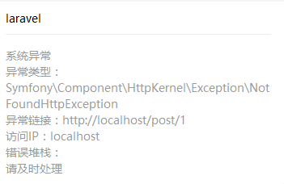

# Install

## Require
php > 5.6.4 (php 7 is better, php5.6 is untested)  
any server, like: nginx apache (options)  
composer  
redis (cache posts)  

## Install Steps

1. [install composer](https://getcomposer.org/doc/00-intro.md)

2. clone project
`git clone git@github.com:tradzero/blog.git` 

3. install dependency  
`composer install`

4. copy .env.example to.env  
on Linux： `cp .env.example .env`  
on Windows： `copy .env.example .env`

5. generate app key  
`php artisan key:gen`

6. create a database  
`create database xxx; # xxx is database name`

7. fill out environment config  

```
DB_DATABASE= # database name
DB_USERNAME= # database connect username
DB_PASSWORD= # database connect password

REDIS_PASSWORD= # REDIS password
```

8. run database migrate  
`php artisan migrate`

9. config and run server  
it you don't have or wan't use regular servers, you can use php's  UIlt-in server  
run `php artisan serv` via `http://127.0.0.1:8000`

10. you can alse see [laravel installation](https://laravel.com/docs/5.4/installation) for reference

## .env description

```
# [qiniu cloud](http://www-src.qiniu.com/) config, i used it for file upload as default .

QINIU_AK=     # qiniu storage AccessKey
QINIU_SK=     # qiniu storage SecretKey
QINIU_BUCKET= # qiniu storage bucket name
QINIU_URL=    # qiniu storage url domain

# wechat config , Blog used it for bug event push.
# i recommend use wechat sandbox account, untest in product account.
WECHAT_APPID=        # wechat appID
WECHAT_SECRET=       # wechat appsecret
WECHAT_TOKEN=        # wechat token(option)
WECHAT_AES_KEY=      # wechat aes_key(option)
WECHAT_USER_OPENID=  # wechat user OPENID for receive wechat notice
WECHAT_TEMPLATE=     # wechat notice feature template id
WECHAT_DEBUG=        # enable wechat debug notice, default false
```

# Feature

1. backend  
http://yourdomain/admin backend url you can use `php artisan account:admin` to create your admin account.

2. error wechat notice  
This feature implement by [easywechat](https://easywechat.org/)  
automatic report and notice from wechat when error throwed  
  
template for reference：  
`{{first.DATA}} error type：{{keyword1.DATA}} error url：{{keyword2.DATA}} IP Address：{{keyword3.DATA}} error traces：{{error.DATA}} {{remark.DATA}}`

# Dependence

## [Laravel](https://laravel.com/)  
version: 5.3

## [laravel-debugbar](https://github.com/barryvdh/laravel-debugbar)

## [parsedown](https://github.com/erusev/parsedown)  
markdown to HTML package

## [laravel-wechat](https://easywechat.org/)  
easywechat laravel package

## [php-sdk](https://github.com/qiniu/php-sdk)  
qiniu php sdk

## [laravel-5-markdown-editor](https://github.com/yccphp/laravel-5-markdown-editor)  
markdown web editor

## [adminlte](https://adminlte.io/)  
backend UI template

## [vue](https://cn.vuejs.org/)
javascript framework

## [rainbow](https://github.com/ccampbell/rainbow)  
frontend code highlight

## [wysiwyg.css](https://github.com/jgthms/wysiwyg.css)
markdown github style css component

## [bootstrap](http://getbootstrap.com/)
frontend ui framework

# License

This blog is licensed under the [GNU General Public License v3.0](http://www.gnu.org/licenses/gpl-3.0.html)

# Contribution
Wecome issue, wecome star, any idea or problem can send email to me or contact me by any way.